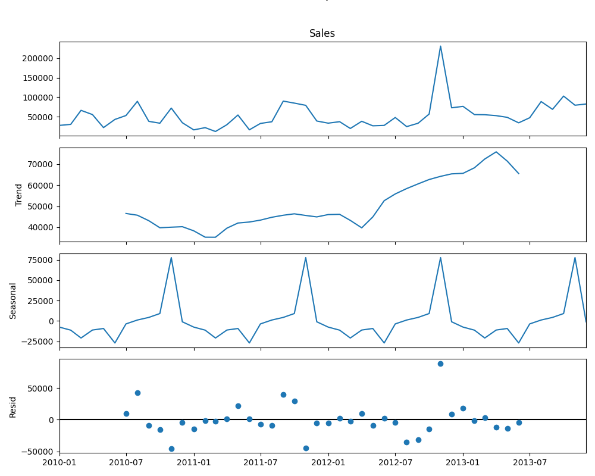

# Indian-Retail-Data---Sales-Forecasting

## Objective

The goal of this project is to analyze historical transactional sales data and develop a reliable time series model to forecast future sales. The project demonstrates a complete workflow, from data preprocessing and exploratory analysis to model selection, validation, and forecasting.

## Data

The initial dataset consists of 18 columns (2534 rows) of individual order data. The key columns used for this analysis are:
* `Sales`: The target variable for forecasting.
* `Order Date`: The datetime index used to create the time series.

## Methodology

The project followed a systematic process to arrive at a stable and accurate forecasting model.

### 1. Data Preprocessing

The raw transactional data was not suitable for time series modeling. The first step was to aggregate the data into a regular time series.

* The `Order Date` column was set as the index.
* The `Sales` column was **resampled by month start (`'MS'`)** to create a monthly sales time series.

### 2. Exploratory Analysis & Initial Modeling

* **Decomposition:** The `statsmodels.tsa.seasonal_decompose` function was used to break the time series into its **Trend**, **Seasonality**, and **Residual** components. This visually confirmed a strong annual (12-month) seasonality.
* 

* **Stationarity Test:** The **Augmented Dickey-Fuller (ADF)** test was used to check for stationarity.
* **Simple ARIMA Models:** Initial attempts using `ARIMA(1, 1, 1)` and `ARIMA(0, 1, 1)` failed.
    * **Result:** The models produced a "flat-line" forecast, completely ignoring the seasonal pattern.
    * **Diagnostics:** The model summaries showed critical failures. The `Jarque-Bera (Prob(JB) = 0.00)` test indicated residuals were not normally distributed, and `Prob(H) = 0.00` indicated non-constant variance. Critically, a `Covariance matrix is singular` warning invalidated the results.

### 3. Model Refinement: SARIMA and Log Transformation

The failures of the simple ARIMA model pointed to two problems:
1.  **Seasonality:** The model was not accounting for the 12-month cycle.
2.  **Variance/Normality:** The data's variance was not stable, and the distribution was skewed.

**Solution:**
1.  **Model:** A **SARIMA** (Seasonal ARIMA) model was chosen to handle the seasonal component.
2.  **Transformation:** A **log transformation (`np.log(sales_ts + 1)`)** was applied to the data *before* modeling. This stabilizes the variance and helps normalize the data, which is essential for fixing the diagnostic test failures.

### 4. Model Selection: Grid Search

To find the best parameters `(p,d,q)(P,D,Q,m)` for the SARIMA model, a manual **grid search** was performed.

* A range of values for `p, d, q` (non-seasonal) and `P, D, Q` (seasonal) was defined (typically 0 or 1).
* The script looped through all possible combinations, fitting a `statsmodels.api.SARIMAX` model for each.
* The model with the **lowest AIC (Akaike Information Criterion)** was selected as the champion model.

---

## Final Model & Results

The grid search (performed on the log-transformed data) identified the optimal model:

**`SARIMAX(0, 1, 1)x(0, 1, 1, 12)`**

This model had the lowest AIC (`35.440`) and, most importantly, **passed all diagnostic tests:**

* **`Ljung-Box (Prob(Q) = 0.91)`:** Residuals are not correlated (they are random white noise). **[PASSED]**
* **`Jarque-Bera (Prob(JB) = 0.77)`:** Residuals are normally distributed. **[PASSED]**
* **`Heteroskedasticity (Prob(H) = 0.78)`:** Error variance is constant. **[PASSED]**

The critical `Covariance matrix is singular` warning was also resolved. This confirms the model is statistically valid and reliable.

### Forecasting

The final, validated model was used to forecast the next 12 months.

1.  The model was fit to the *entire* log-transformed dataset.
2.  The `.forecast(steps=12)` method was called to get the predictions (which were in log scale).
3.  The predictions were transformed back to the original dollar scale using the **exponential function (`np.exp(forecast) - 1`)**.

The resulting forecast correctly captured the seasonal peaks and valleys of the sales data.

## Libraries Used

* `pandas`: For data loading and resampling.
* `numpy`: For numerical operations and the log/exp transformations.
* `statsmodels.api`: For time series decomposition (ADF) and `SARIMAX` modeling.
* `itertools`: For building the parameter grid search.
* `matplotlib`: For plotting the historical data and forecast.
